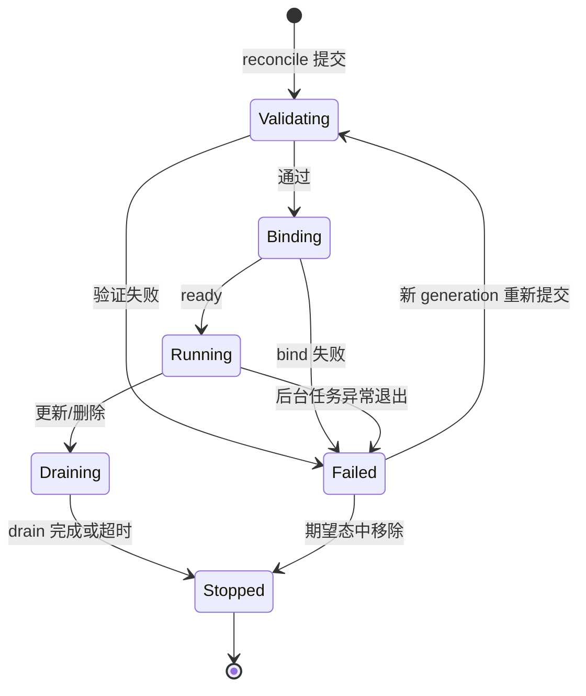
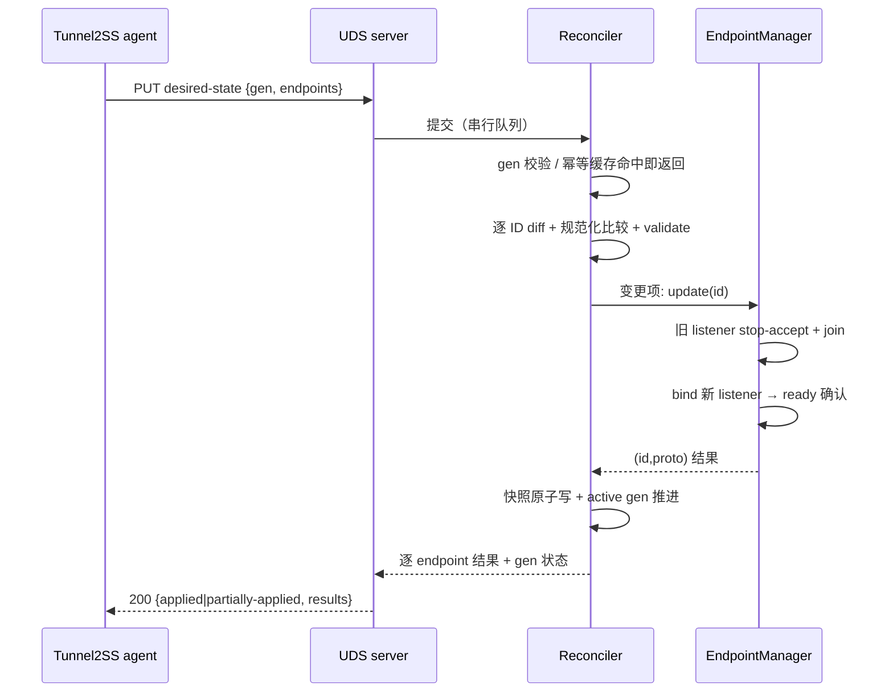

# Realm Hot-Reload Fork - Plan

## Goal Capsule

- **Objective:** 让 Tunnel2SS 节点上的 Realm 支持逐 endpoint 热更新——修改一条转发规则不重启进程、不影响其他 endpoint、已有 TCP 连接无损。手段是纯私有 fork：重构 realm_core 为统一 endpoint 生命周期模型，并通过 Unix domain socket 暴露 desired-state reconcile API。
- **Product authority:** 本文档 Product Contract；背景证据链见 `docs/research/2026-07-22-realm-hot-reload-fork-research.md`。
- **Execution profile:** U4/U5/U6 是 safety-critical 核心（修复 `Ref<T>` use-after-free 隐患），test-first；其余单元常规实现。全程在 worktree 隔离分支执行。
- **Stop conditions:** 发现任何 session-settled 决策不可行的证据（如 `Arc` 化性能回归超出噪声且无法归因）→ 停下上报，不得静默改道；实现被迫改变 Product Contract 语义 → 停下走文档变更流程。
- **Open blockers:** 本机未安装 cargo（`rust-toolchain.toml` 固定 nightly）；U1 首先补齐构建环境。
- **Tail ownership:** 提交、代码评审、PR 由执行流程（ce-work）收尾。

---

## Product Contract

### Summary

以上游 v2.9.4 为基线的纯私有 Realm fork：realm_core 重构为统一 endpoint 生命周期模型（per-generation owned `Arc` 配置、取消与 drain 追踪、`Ref<T>` 全面移除），其上通过 Unix domain socket 暴露 desired-state reconcile API（稳定 ID + 单调 generation）。Tunnel2SS agent 提交节点完整期望状态，Realm 原子计算差异，只变更实际改动的 endpoint。

### Problem Frame

Tunnel2SS 把一个节点上的全部转发规则聚合进同一个 Realm 配置和进程。任何一条规则变更都会重新生成配置并 `systemctl restart realm`：未修改的 endpoint 短暂拒绝新连接，进程内全部既有连接一起断开。

官方 Realm（v2.9.3 / v2.9.4）没有任何 reload 信号、配置 watcher 或动态 endpoint 管理入口。上游 PR #160 验证了"单进程内分别管理 endpoint"的需求，但其实现直接 `abort()` listener task——而 realm_core 的连接子任务通过裸指针包装 `Ref<T>` 借用 listener 栈上状态，abort 会造成悬空指针与未定义行为；其 API 模型（随机 UUID 逐条 CRUD、假同步状态、非幂等）也不适配 Tunnel2SS 的期望状态发布。浅层包装路线已被证伪，必须先解决所有权。

### Key Decisions

- **纯私有长期 fork** (session-settled: user-directed — chosen over 长期依赖并回馈上游、临时过渡分支: 重构自由度优先，不投入上游回馈成本)
- **硬分叉 v2.9.4 + 选择性吸收** (session-settled: user-approved — chosen over 定期整版本 rebase: 与自由重构矛盾)。定期关注上游 release 与安全通告，按需 cherry-pick 安全/关键修复；依赖更新自行 `cargo update` 加安全扫描。
- **统一生命周期模型，静态模式为特例** (session-settled: user-approved — chosen over 双路径最小动态层、每规则一进程编排: 长期只维护一套所有权模型)。lifecycle 抽象放 realm_core；每个 endpoint 是 owned 状态机；现有 CLI/TOML 静态模式等价于"启动时提交 generation 0"，行为完全兼容。
- **`Ref<T>` 全面移除** (session-settled: user-approved — chosen over 仅动态路径替换: 双模型共存使安全性继续依赖注释约定)。连接/关联任务持有 owned `Arc` 数据；取消经 cancellation + join/drain，禁止 abort-and-forget。
- **Core 先于 API** (session-settled: user-approved — chosen over 在 run_tcp/run_udp 外包控制层: PR #160 反例证明控制面不是难点，所有权才是)。控制面只是 core lifecycle 接口的 adapter。
- **Desired-state reconcile，而非逐条 CRUD** (session-settled: user-approved — chosen over 随机 UUID 逐条 CRUD: 重试幂等、无部分成功中间态歧义)。
- **保护口径：已有 TCP 连接无损** (session-settled: user-approved — chosen over 新旧连接都零中断: FD handoff 成本高一个量级)。同端口替换用 stop-accept → join → bind，接受毫秒级新连接空窗；API 契约不排除未来升级到零空窗。
- **UDP 第一版受控重建** (session-settled: user-approved — chosen over 与 TCP 同步无损: UDP 状态机重设计成本高，且 UDP 应用普遍容忍重建)。
- **逐 endpoint 独立生效** (session-settled: user-approved — chosen over 全有或全无: 符合"改 A 不影响 B"，避免回滚二次失败路径)。
- **分级回退** (session-settled: user-approved — chosen over 失败即 restart、从不自动 restart: 配置类失败永不触发全量断线，进程级故障保留最后手段)。
- **Drain 按操作区分** (session-settled: user-approved — chosen over 统一有限/统一无限超时: 删除即停是计费与封禁场景的底线)。修改默认无限 drain；删除默认 30 秒后强制关闭；均可逐 endpoint 覆盖。
- **控制协议：UDS 上的 HTTP/1.1 + JSON** (session-settled: user-approved — chosen over gRPC、自定义帧协议: `curl --unix-socket` 可直接调试，生态成熟，本机通信无需 TLS)。
- **Backend 唯一事实源；Realm 自存 last-known-good 快照** (session-settled: user-approved — chosen over 完全无持久化: crash 自愈需立即恢复转发，不能等 agent 下轮 reconcile)。快照是 Realm 自有运行时状态，带 generation 标记，不构成与 backend 的双 writer。

### Requirements

**Core 生命周期（realm_core 重构）**

- R1. 每个 endpoint 由 owned 状态机管理：generation 的运行配置是不可变 owned 数据，TCP 连接在 accept 时捕获当前 generation 的 `Arc`，此后 listener 变更不影响该连接。
- R2. `Ref<T>` 从代码库移除；任务终止必须经 cancellation 信号加 join/drain 确认，不允许 abort 后遗弃。
- R3. endpoint 生命周期操作独立于控制面存在且可测试：validate（无副作用）、bind/start（ready 后才返回成功）、stop-accept、drain、状态查询、等待资源释放。
- R4. 配置验证返回结构化错误而非 panic；无效输入不影响进程存活和其他 endpoint。
- R5. 静态 CLI/TOML 模式行为与上游兼容，实现上等价于启动时提交 generation 0。

**Reconcile API（控制面契约）**

- R6. agent 通过 UDS 提交完整期望状态（generation + 按稳定 ID 索引的 endpoint 集合）；Realm 计算与当前状态的差异，只变更实际改动的 endpoint。
- R7. endpoint ID 由调用方提供，Realm 视为不透明的稳定 key。
- R8. generation 是调用方提供的单调递增整数：同 generation 重复提交幂等（不产生重复 endpoint 或重复扰动）；小于 active generation 的提交被拒绝。
- R9. 单个 endpoint 验证或 bind 失败不阻塞其他 endpoint：已存在的保持旧配置继续服务，新增的标记 failed；响应报告逐 endpoint 结果（unchanged / created / updated / draining / deleted / failed 及错误详情）和 generation 整体状态（applied / partially-applied）。
- R10. 状态真实性：endpoint 仅在 bind 成功并 ready 后报告 running；后台任务退出必须反映到状态查询结果，不允许假 running。
- R11. 可查询 active generation、逐 endpoint 实际运行状态、进程 readiness/health。
- R12. 控制面仅本机可达：UDS 加文件权限，不监听 TCP；有请求大小限制；审计日志不含敏感 transport 参数。
- R23. 一条规则的 TCP 与 UDP 数据面独立成败：状态与 reconcile 结果按 (id, 协议) 二级粒度上报，单侧失败构成该 ID 的混合态。
- R24. reconcile 请求全局串行（single-flight）；同 generation 的并发或重复提交折叠为首次执行的结果，不重试其中 failed 的 endpoint。
- R25. active generation 在一次应用完成时推进，partially-applied 作为 generation 状态暴露；failed endpoint 的自愈通过提交新 generation 表达。
- R26. 静态模式（generation 0）endpoint 的稳定 ID 按 listen 地址 + 协议确定性派生，使 agent 首次接管的 diff 不产生虚假重建。
- R28. 同一 generation 内 listen 地址 + 协议重复的 endpoint 在 validate 阶段确定性标记为 failed，不进入 bind。
- R29. 空 endpoint 集合的期望态照常执行（删除全部），并产生显著审计日志。
- R30. UDS socket 生命周期受管：启动时对残留 socket 先 connect 探活，死则 unlink 重建；socket 与父目录权限 0700 并归属明确属主。
- R31. API 错误按 retryable / terminal 二分标注：stale generation 与 validation 失败为 terminal，bind 冲突与 internal 为 retryable，未就绪为 retryable 且重试安全。
- R32. capability 探测通过显式 version / capabilities 查询端点完成，响应含契约 schema 版本。
- R36. 状态查询暴露逐 (id, 协议) 的活跃连接数与 draining cohort（generation、计数、存续时长），使 drain 完成可被 agent 确认。

**更新语义（数据面行为）**

- R13. 修改 endpoint：既有 TCP 连接继续使用旧 generation 直至自然结束（默认无限 drain，可配置超时）；新连接在新配置 ready 后使用新 generation。
- R14. 同 listen 地址替换按 stop-accept → 等待旧 socket 释放 → bind 新 listener 执行，接受毫秒级新连接空窗；新 bind 失败时尽力恢复旧 listener，并在响应与状态中标记 failed。
- R15. 删除 endpoint：立即停止 accept 并释放 listener socket（端口即时可复用）；既有连接默认 drain 30 秒后强制关闭，超时可逐 endpoint 覆盖。
- R16. UDP endpoint 变更时旧 association 受控终止、由客户端重建；该影响在 API 状态中如实暴露，不承诺无损。
- R17. 契约明确"修改默认不终止既有连接"：封禁等必须立即止流的操作应通过删除或带显式 drain 超时的修改表达。
- R27. listen 地址变更采用先起新址、旧址转入 drain 的顺序；同一 generation 内的地址迁移按 bind 依赖排序执行。

**持久化与恢复**

- R18. Tunnel2SS backend 是唯一 desired-state 事实源；Realm 不重写 Tunnel2SS 管理的静态配置文件。
- R19. Realm 自存带 generation 的 last-known-good 快照：进程重启后立即恢复该快照继续服务，随后由 agent 的下一次 reconcile 收敛到 backend 认可状态。
- R20. 快照写入原子且有序，不得出现旧快照覆盖新快照。
- R33. 快照恢复完成前收到的 reconcile 返回明确的未就绪（retryable）错误；readiness 覆盖"恢复完成"。
- R34. 快照部分恢复复用 partially-applied 语义：失败 endpoint 逐条标记，进程存活，active generation 携带 partial 标记。

**回退与兼容**

- R21. 配置类失败永不触发整进程 restart；仅进程级故障（控制面不可用、进程异常、连续 reconcile 超时）允许外部执行 restart 作为最后手段。
- R22. fork 暴露 capability/版本查询，供 agent 区分 fork 与官方 Realm，支持灰度发布和回退官方二进制。
- R35. 全局配置（DNS、log、rlimit、TLS provider、hook 动态库、relay 缓冲参数）启动期冻结、变更需进程重启；status 暴露当前生效值供 agent 探测漂移。

### Key Flows

endpoint 生命周期状态机（R1、R3、R10、R13–R15 的共同骨架，粒度为 (id, 协议)）：



- F1. Reconcile 提交
  - **Trigger:** agent 通过 UDS 提交 {generation, endpoints}。
  - **Steps:** 校验 generation（stale 拒绝，重复幂等返回上次结果）→ 逐 endpoint diff → 无副作用 validate → 对变化项执行 create/update/delete → 汇总逐 endpoint 结果。
  - **Outcome:** 响应含逐 endpoint 状态与 generation 应用状态；未改动的 endpoint 全程不受扰动。
  - **Covers:** R6–R9、R23–R25。
- F2. 同地址 endpoint 更新
  - **Trigger:** reconcile diff 判定某 endpoint 配置变更且 listen 地址不变。
  - **Steps:** 旧 listener stop-accept → join 等待 socket 释放 → bind 新 listener → ready 确认 → 发布新状态；旧连接持有旧 generation `Arc` 继续 drain。
  - **Outcome:** 新连接走新配置；旧连接无感；bind 失败则恢复旧 listener 并标记 failed。
  - **Covers:** R1、R10、R13、R14。
- F3. 进程崩溃恢复
  - **Trigger:** Realm 进程异常退出，systemd 拉起。
  - **Steps:** 加载 last-known-good 快照 → 按快照恢复全部 endpoint → 上报 active generation → agent 下一次 reconcile 收敛差异。
  - **Outcome:** 转发在进程拉起后立即恢复，不等待 agent 轮询周期；恢复期间 reconcile 返回未就绪。
  - **Covers:** R19、R21、R33、R34。

### Acceptance Examples

- AE1. **Covers R6, R9.** **Given** 节点运行 endpoint A、B、C，**When** agent 提交仅修改 A 的新 generation，**Then** B、C 的 listener 与连接全程不受扰动，进程不重启。
- AE2. **Covers R13.** **Given** endpoint A 上有活跃 TCP 长连接，**When** A 的 remote 被修改，**Then** 既有连接继续经旧 remote 传输直至自然结束，新连接走新 remote。
- AE3. **Covers R10, R14.** **Given** A 的新配置在 bind 阶段失败（如端口被占），**When** reconcile 执行，**Then** 旧 listener 被恢复继续服务，A 标记 failed 并携带错误，绝不报告 running。
- AE4. **Covers R8.** **Given** agent 请求超时后重试同一 generation，**When** Realm 收到重复提交，**Then** 不产生重复 endpoint、不重复扰动流量，返回与首次一致的结果。
- AE5. **Covers R8.** **Given** active generation 为 42，**When** 收到 generation 41 的提交，**Then** 拒绝并报告当前 active generation。
- AE6. **Covers R15.** **Given** endpoint A 被删除且未覆盖 drain 超时，**When** 30 秒后仍有存活连接，**Then** 这些连接被强制关闭，A 进入 stopped。
- AE7. **Covers R16.** **Given** UDP endpoint 被修改，**When** 变更生效，**Then** 旧 association 受控终止、状态可查询到该影响，客户端重建后走新配置。
- AE8. **Covers R4, R9.** **Given** 提交中某 endpoint 地址非法，**When** reconcile 执行，**Then** 返回结构化验证错误，进程不 panic，其余 endpoint 正常生效。
- AE9. **Covers R19.** **Given** Realm 进程 crash 后被 systemd 拉起，**When** 启动完成，**Then** last-known-good 快照内的全部 endpoint 立即恢复服务，active generation 与快照一致。
- AE10. **Covers R26.** **Given** 节点以静态 TOML 启动（generation 0），**When** agent 首次以派生 ID 规则提交等价期望态，**Then** 全部 endpoint 判定 unchanged，无任何重建或断流。
- AE11. **Covers R24.** **Given** 两个携带同一 generation 的 reconcile 请求并发到达，**When** Realm 处理，**Then** 只执行一次应用，两个响应返回同一结果。
- AE12. **Covers R23.** **Given** 一条规则同时启用 TCP 与 UDP，**When** 更新时 TCP bind 成功而 UDP bind 失败，**Then** 状态呈现 (id, tcp)=updated、(id, udp)=failed，generation 为 partially-applied。
- AE13. **Covers R33.** **Given** 快照恢复尚未完成，**When** agent 提交 reconcile，**Then** 返回未就绪（retryable）错误；恢复完成后重试成功。
- AE14. **Covers R36.** **Given** endpoint A 修改后旧 cohort 仍有存活连接，**When** agent 查询状态，**Then** 可见该 cohort 的 generation、连接数与存续时长；连接数归零后 cohort 消失。

### Success Criteria

- `Arc` 化后的性能回归可忽略：以 v2.9.4 为基线做 benchmark 留档，吞吐/延迟回归在噪声范围内。
- 高频增删改 endpoint 并保持大量长连接与 UDP association 的压力测试下，task、FD、socket、内存、drain 队列无泄漏。
- stop-accept → join → bind 的新连接空窗实测为毫秒级（Linux IPv4/IPv6 分别验证）。

### Scope Boundaries

**Deferred for later**

- 同端口替换零空窗（FD handoff 或 `SO_REUSEPORT`）——API 契约与 acceptor 结构不排除该演进。
- UDP association 级 drain（旧 association 按旧配置继续服务）。
- 跨主机控制面（TCP + TLS + 独立凭证）——仅当出现明确跨主机需求再评估。
- SIGTERM drain 与 systemd `Type=notify`（sd_notify）集成——agent 以 readiness 端点为准，不依赖 systemd 状态。

**Out of scope**

- Tunnel2SS 侧全部改造（renderer 稳定 ID 化、agent reconcile executor、capability 探测消费端、generation 铸造方选择、灰度策略）——另在 Tunnel2SS 仓库规划，仅消费本契约；本契约对其唯一要求是 generation 单调递增且同值幂等（R8）。
- 上游回馈 PR 与 PR #160 代码复用。
- per-endpoint 的 DNS、hook、relay 缓冲配置——进程级限制（R35），逐 endpoint 差异化不在本产品范围。

**已知残留限制**

- fork 自身二进制升级/回退与进程 stop 会断开该节点全部连接（与现状一致）；这是唯一残留的全量断线路径，缓解归 Deferred 的 SIGTERM drain。

### Dependencies / Assumptions

- 仓库当前即上游 v2.9.4 基线，无本地功能提交（已核实：`Cargo.toml` 版本、git 历史、全仓库无控制面/取消机制代码）。
- `rust-toolchain.toml` 固定 nightly；当前环境无 cargo，构建与测试环境是实施前置条件（U1）。
- 假设 agent 与 Realm 同机部署（UDS 前提）。
- 假设 per-accept 一次 `Arc` clone 的开销可忽略——由 Success Criteria 的 benchmark 验证；若被证伪，需重新评估配置分发机制。
- 假设新增依赖（`tokio-util`、`hyper`、`hyper-util`、`http-body-util`）与 nightly toolchain 及现有依赖树兼容。
- 大量动态 endpoint 场景下 nofile hard limit 需留余量（启动时 `bump_nofile_limit` 一次性设置）——容量规划由 Tunnel2SS 侧部署参数负责。

### Outstanding Questions

**Deferred（不阻塞实施）**

- fork 发布工程：二进制命名、版本号方案、release/签名/回滚工序——独立后续工作，不影响本计划各单元。
- reconcile API 的具体 JSON 字段命名与 schema 版本号策略——契约语义已在 R6–R36 定死，字段拼写在 U9 实现时定案。

### Sources / Research

- `docs/research/2026-07-22-realm-hot-reload-fork-research.md` — 完整研究报告：Tunnel2SS 现状证据链、上游与 PR #160 审查、候选设计边界、验收基线、风险清单。
- 关键代码位置：`realm_core/src/trick.rs`（`Ref<T>` 裸指针包装与安全注释）；`realm_core/src/tcp/mod.rs:33-66`（`run_tcp` 栈上状态经 `Ref` 交给 detached 连接任务，无 teardown 路径）；`realm_core/src/udp/middle.rs:126-173`（listener/SockMap 经 `Ref` 交给 detached `send_back`，子任务可比父循环活得更久）；`src/bin.rs:126-151`（endpoint 启动时一次性构建，无运行期增删入口）；`src/conf/`（panic 式解析；`FullConf::from_conf_str` 已返回 `Result` 但唯一调用方对 Err panic）。
- 全局单例（热更新耦合点）：`realm_core/src/dns/mod.rs:48-90`（`static mut` + `OnceCell`，二次配置 panic）；`realm_hook/src/pre_conn.rs:8`（hook 动态库单例）；`src/bin.rs:76-89`（fern log 仅可 apply 一次）；`realm_io/src/mem_copy.rs:50`、`realm_io/src/linux/zero_copy.rs:121`（进程级缓冲参数）；`realm::core::kaminari::install_tls_provider`（进程级 TLS provider）。
- 依赖与惯例：`realm_core/Cargo.toml:28`（tokio 仅 `rt,net,time`，无 `sync`/`signal`）；`src/conf/endpoint.rs:14-51`（`EndpointConf` 为 serde 友好原始配置形状，无 id 字段）；`realm_core/tests/`（黑盒集成测试惯例，无内嵌单元测试）；`.github/workflows/ci.yml`（realm_core 测试仅显式 `--features proxy` 的漏测风险）。
- 上游参考：PR #160（https://github.com/zhboner/realm/pull/160）及维护者关于先重构 core 接口的评论（https://github.com/zhboner/realm/pull/160#issuecomment-3700720776）；官方 v2.9.4 release（https://github.com/zhboner/realm/releases/tag/v2.9.4）。
- 控制面选型依据：hyper 1.x `server::conn::http1::Builder::serve_connection` 接受任意 `Read + Write` IO，`hyper_util::rt::TokioIo` 包装 tokio `UnixStream` 即可服务（docs.rs/hyper 1.10 server::conn::http1）——无需 axum/tower。

---

## Planning Contract

**Product Contract preservation note:** 增强为纯增量——新增 R23–R36（研究确认的契约空白，已经用户确认）、AE10–AE14、Scope Boundaries 三处增补、Sources 扩充；R15 一处澄清（listener socket 随删除立即释放）。其余原文与全部 ID 未改动。R37 起为后续保留（R编号跳过 R27 前后的排列为分组内插入所致，无缺号语义）。

### Key Technical Decisions

- KTD1. **生命周期原语：`tokio_util::sync::CancellationToken` + 连接注册表（计数 + 逐连接 token）。** `realm_core` 增加 tokio `sync` 与 `macros` feature 并新增 `tokio-util` 依赖（当前仅 `rt,net,time`，见 `realm_core/Cargo.toml:28`）。listener 循环 `select!` 于 accept 与 token；连接任务注册进 per-cohort 注册表以支撑 R36 的计数与 R15 的超时强制关闭。不用 `JoinSet` 聚合连接（drain 需要按 cohort 分组统计，`JoinSet` 无分组语义）。
- KTD2. **控制面栈：hyper 1.x http1-only + `hyper-util` `TokioIo` + `http-body-util`，直接跑在 tokio `UnixListener` 上；不引入 axum/tower。** (session-settled: user-approved — 继承 Key Decision "控制协议：UDS 上的 HTTP/1.1 + JSON"，chosen over gRPC、自定义帧协议) 依赖面最小、`curl --unix-socket` 可调试；serde/serde_json 已在依赖树中。HTTP 依赖只进顶层 crate 的 `control` feature，realm_core 不依赖 HTTP。
- KTD3. **reconcile 请求为 {generation, endpoints}，其中每个 endpoint 是 `EndpointConf`（serde 友好原始配置，`src/conf/endpoint.rs:14-51`）加 {id} 包装；generation 位于请求顶层，不逐 endpoint 携带。diff 用规范化后的 `EndpointConf` 比较。** `extra_remotes` 顺序视为 significant（`balance` 权重按索引对应，乱序即语义变化，见 `realm_core/src/tcp/middle.rs:68`）；validate 阶段同时校验 balancer 权重数与 `extra_remotes` 长度一致。
- KTD4. **per-generation 运行配置为 `Arc<EndpointRuntime>`（由 `EndpointConf::build` 产物组成），accept/associate 时 clone；`realm_core/src/trick.rs` 删除。** (session-settled: user-approved — 继承 Key Decision "`Ref<T>` 全面移除") `Endpoint` 全字段已 `derive(Clone)`（`realm_core/src/endpoint.rs:38-73`），无结构障碍。`connect_and_relay`/`send_back` 签名从 `Ref<T>` 改为 owned `Arc`。
- KTD5. **DNS 重写为安全的一次性初始化（`OnceLock` 或等价），保持进程级冻结。** 现状 `static mut` + `OnceCell::set().unwrap()` 二次配置即 panic（`realm_core/src/dns/mod.rs:48-90`），且注释自认 not thread-safe——必须重写为不可触发 UB/panic 的形式，但语义保持进程级（R35）；per-endpoint DNS 是明确的产品限制而非实现遗漏。
- KTD6. **drain 超时强制关闭 = 取消 owned 连接任务（结构化 shutdown），与 `realm_io` 的 `brutal-shutdown`（单流半关闭语义、编译期 feature、默认开启）是两个层面，互不修改。** 实现者不得混淆：R15 的"30 秒强制关闭"作用于任务级 cancellation token，不改动 `realm_io/src/bidi_copy.rs` 的流级半关闭行为。
- KTD7. **控制面为顶层 crate 的 cargo feature `control`，加入 fork 的 default features；关闭时构建产物与上游 CLI 行为等价。** 保持纯 CLI 构建能力，同时 Tunnel2SS 部署默认可用。
- KTD8. **状态模型：`EndpointEntry { id, per-proto slot × {tcp, udp} }`，每个 slot 持有状态机状态 + active runtime + draining cohorts 列表。** 一条规则最多两个数据面（`src/bin.rs:139-145` 的 `no_tcp`/`use_udp` 展开），(id, 协议) 是最小独立成败单元（R23）。
- KTD9. **快照 = {generation, partial 标记, 规范化 EndpointConf 集}，tmp + rename 原子写，由 single-flight 的 reconcile 串行执行保证有序（R20/R24）。** 快照文件位于 Realm 自有 runtime 目录，与 Tunnel2SS 静态配置文件物理分离（R18）。

### High-Level Technical Design

组件拓扑（新增组件为粗边界，现有模块复用）：

```mermaid
flowchart TB
    subgraph bin["src/ (顶层 crate)"]
        CLI[CLI / TOML 启动链<br/>daemonize → 全局初始化] --> GEN0[静态配置 → generation 0]
        CTRL[control feature:<br/>UDS server hyper http1]
    end
    subgraph core["realm_core"]
        REC[Reconciler<br/>single-flight · diff · generation]
        MGR[EndpointManager<br/>状态机 · (id,proto) slots]
        SNAP[Snapshot<br/>last-known-good]
        TCP[tcp lifecycle task<br/>owned Arc runtime]
        UDP[udp lifecycle task<br/>owned Arc runtime]
    end
    GEN0 --> REC
    CTRL -->|reconcile / status / readiness / version| REC
    REC --> MGR
    REC --> SNAP
    MGR --> TCP
    MGR --> UDP
```

reconcile 请求时序（同地址更新路径）：



endpoint 状态机见 Product Contract Key Flows 的 stateDiagram（粒度 (id, 协议)，本节不重复）。

### Output Structure

新增文件的预期布局（方向性声明，实现可依据实际情况调整；各单元 Files 字段为准）：

```text
realm_core/src/lifecycle/
    mod.rs        # EndpointManager、EndpointEntry、(id,proto) 状态机
    cohort.rs     # draining cohort 注册表：计数、存续时长、超时强制关闭
    reconcile.rs  # Reconciler：single-flight、diff、generation/幂等语义
    snapshot.rs   # last-known-good 序列化、原子写、启动恢复
src/control/
    mod.rs        # feature `control` 入口与装配
    server.rs     # UDS listener 生命周期、hyper http1 连接服务
    api.rs        # 路由、请求/响应 DTO、retryable/terminal 错误分类、审计日志
```

### Risks & Mitigations

| 风险 | 影响 | 缓解（落点） |
|---|---|---|
| 动态取消触发 `Ref<T>` use-after-free | UB、崩溃、数据错误 | U4/U5 test-first 重构，`trick.rs` 删除；Verification 的 `rg 'Ref<'` gate |
| 状态虚假 running（bind 后台失败） | agent 误判成功、流量黑洞 | U6 ready handshake + 任务监视转 Failed；AE3 |
| 同端口替换竞态（旧 socket 未释放） | 新 bind 失败 | U6 stop-accept → join → bind 严格顺序；U11 空窗测量 |
| UDP association 清理不全 | task/socket 泄漏、回包异常 | U5 受控终止协议（token 广播 + 等待退出）；U11 泄漏压力测试 |
| 快照与 backend 配置双 writer 漂移 | 重启回退到错误状态 | R18/R19 职责分离；KTD9 快照仅存 Realm 运行态（U8） |
| 重试产生重复 endpoint / 重复扰动 | 流量抖动、状态漂移 | R8/R24 幂等折叠 + 结果缓存（U7）；AE4/AE11 |
| 控制面暴露面过大 | 任意转发/删除规则 | R12/R30 UDS 0700 fail-closed、请求限制（U9） |
| nightly 无日期 pin，新 nightly 随时破坏构建 | CI 漂移、不可复现构建 | U1 评估 pin 具体 nightly 日期（`rust-toolchain.toml` channel 现仅 "nightly"） |
| 上游安全修复遗漏 | 已知缺陷长期存在 | Key Decision 硬分叉 + 选择性吸收：定期巡检上游 release/安全通告（运营惯例，非本计划单元） |
| 分级回退的 restart 重新引入全量断线 | 失败路径破坏连接保护预期 | R21 限定 restart 仅进程级故障；Tunnel2SS 侧执行策略（范围外，契约已约束） |

### Implementation Constraints

- daemonize（`fork()`）必须先于 tokio runtime 构建（`src/cmd/mod.rs:64-128` 现有顺序）；UDS server 只能挂在 `src/bin.rs` 的 `run()` 链路内启动。
- `install_tls_provider`、hook 动态库加载、fern log `apply`、rlimit 设置均为进程级一次性初始化，不进入 reconcile 可变面（R35）。
- lifecycle 核心（`realm_core/src/lifecycle/`）不得依赖 `transport`/`balance`/`proxy` 之外的 feature 组合才能编译测试——CI 的 realm_core 测试当前仅 `--features proxy`（`.github/workflows/ci.yml`），U11 显式化 feature 矩阵前，新测试必须在该最小集合下可运行。
- 测试遵循仓库惯例：黑盒集成测试放 `realm_core/tests/` 与顶层 `tests/`，不写内嵌 `#[cfg(test)]` 单元测试。
- rustfmt：`max_width=120`、不重排 imports/modules（`rustfmt.toml`）；clippy 无自定义配置，无法消除的 lint 就地 `#[allow]`。

---

## Implementation Units

| U-ID | 单元 | 关键文件 | 依赖 |
|---|---|---|---|
| U1 | 构建环境与依赖底座 | Cargo.toml, realm_core/Cargo.toml | — |
| U2 | conf 结构化验证去 panic | src/conf/, src/bin.rs | U1 |
| U3 | DNS 全局状态安全化 | realm_core/src/dns/mod.rs | U1 |
| U4 | TCP 数据面所有权重构 | realm_core/src/tcp/ | U1 |
| U5 | UDP 数据面所有权重构 + trick.rs 删除 | realm_core/src/udp/, trick.rs | U4 |
| U6 | Endpoint 生命周期管理器 | realm_core/src/lifecycle/{mod,cohort}.rs | U2, U4, U5 |
| U7 | Reconciler 与 generation 语义 | realm_core/src/lifecycle/reconcile.rs | U6 |
| U8 | 快照持久化与恢复 | realm_core/src/lifecycle/snapshot.rs | U7 |
| U9 | UDS 控制面 server | src/control/ | U1, U7, U8 |
| U10 | bin.rs 集成与静态模式 gen0 | src/bin.rs, src/cmd/ | U6–U9 |
| U11 | 集成测试套件与 CI feature 矩阵 | realm_core/tests/, tests/, ci.yml | U6–U10 |
| U12 | 性能基线 benchmark | docs/benchmarks/ | U4, U5 |

### U1. 构建环境与依赖底座

- **Goal:** 补齐 toolchain 与依赖，使后续单元可编译、可测试。
- **Requirements:** KTD1、KTD2、KTD7 的前置；无直接 R。
- **Dependencies:** 无。
- **Files:** `Cargo.toml`、`realm_core/Cargo.toml`、`rust-toolchain.toml`。
- **Approach:** 安装 rustup + nightly toolchain；`rust-toolchain.toml` 现仅固定 channel = "nightly"，本单元评估并 pin 到具体 nightly 日期；`realm_core` tokio features 增加 `sync` 与 `macros`（`select!` 由 `macros` 门控，当前仅 dev-dependencies 启用），新增 `tokio-util`（CancellationToken）；顶层 crate 新增 feature `control` = `hyper`（http1+server）+ `hyper-util`（tokio）+ `http-body-util`，并加入 default features；`cargo check --all-features` 与最小 feature 组合各过一次。
- **Test scenarios:** Test expectation: none — 纯依赖/环境变更，验证以构建通过为准。
- **Verification:** 默认与 `--no-default-features --features default-slim` 两种构建成功；`cargo tree` 确认无重复重型依赖引入。

### U2. conf 结构化验证去 panic

- **Goal:** 配置解析与构建全链路返回结构化错误，CLI 路径保持原有报错退出行为。
- **Requirements:** R4。
- **Dependencies:** U1。
- **Files:** `src/conf/endpoint.rs`、`src/conf/mod.rs`、`src/conf/net.rs`、`src/bin.rs`、`tests/conf.rs`（新建）。
- **Approach:** `EndpointConf::build` → `Result<EndpointInfo, BuildError>`（地址解析的 `expect`/`unwrap`——`src/conf/endpoint.rs:54-75`——全部收敛为错误变体，错误信息含字段名）；`FullConf::from_conf_file` 的 panic 路径（`src/conf/mod.rs:84-107`）Result 化，复用已有 `from_conf_str` 的 `Result` 形状；CLI 静态模式在 `bin.rs` 顶层捕获错误、打印并非零退出（行为与上游 panic 等效但可控）。
- **Patterns to follow:** `Config` trait 与 `rst!`/`take!` 宏体系（`src/conf/mod.rs:30-46,178-196`）保持不动，只改错误通道。
- **Test scenarios:** 非法 listen 地址返回含字段名的错误而非 panic；非法 remote 端口同理；合法配置构建产物与改造前等价；CLI 传非法配置以非零码退出且 stderr 含错误。
- **Verification:** `rg 'unwrap|expect|panic' src/conf` 仅剩注释或不可达分支；现有 4 个集成测试不受影响。

### U3. DNS 全局状态安全化

- **Goal:** 移除 `static mut` DNS 单例的 UB/panic 风险，语义保持进程级一次初始化。
- **Requirements:** R35（部分）；KTD5。
- **Dependencies:** U1。
- **Files:** `realm_core/src/dns/mod.rs`、`src/bin.rs`（`setup_dns` 调用点）。
- **Approach:** `static mut OnceCell` → `OnceLock`（或 `OnceCell<Arc<TokioResolver>>` 等安全等价）；重复初始化返回 `Err` 而非 panic；提供只读的当前生效配置查询供 status 暴露（R35）。
- **Test scenarios:** 初始化一次后解析正常；二次初始化返回错误不 panic；未初始化时走默认 resolver 行为与上游一致。
- **Verification:** `rg 'static mut' realm_core/src/dns` 无匹配；`cargo test -p realm_core --features proxy` 绿。

### U4. TCP 数据面所有权重构

- **Goal:** `run_tcp` 及连接任务改为 owned 所有权，支持受控停止与连接追踪，消除 TCP 侧 `Ref<T>`。
- **Requirements:** R1、R2（TCP 侧）、R10（bind 不 panic）、R36（TCP 连接计数）。
- **Dependencies:** U1。
- **Files:** `realm_core/src/tcp/mod.rs`、`realm_core/src/tcp/middle.rs`、`realm_core/src/endpoint.rs`（新增 runtime 聚合类型）、`realm_core/tests/tcp.rs`。
- **Approach:** 按 KTD4 定义 `Arc<TcpRuntime>{raddr, conn_opts, extra_raddrs}`；`connect_and_relay` 签名改收 `Arc`（`realm_core/src/tcp/middle.rs:19-24` 现为三个 `Ref` 参数）；listener 循环 `select!` accept 与 CancellationToken；bind 失败 `panic!`（`tcp/mod.rs:37`）改 `Result` 上抛；每连接注册进带计数的 cohort 句柄，任务结束自动注销；强制关闭经逐连接 token 触发。
- **Execution note:** safety-critical。先写失败测试：停止 listener 后既有长连接必须继续双向传输至自然关闭——这同时是研究报告第 11 节的 TCP ownership 原型实验。
- **Patterns to follow:** 现有 `realm_core/tests/tcp.rs` 的黑盒测试形态（真实 bind + 客户端驱动）。
- **Test scenarios:** Covers AE2（核心路径）. 停 accept 后既有连接持续传输；取消 token 后连接任务全部退出且计数归零；bind 失败返回 Err；`proxy`/`transport` feature 组合下 relay 行为不变（smoke）。
- **Verification:** `rg 'Ref<' realm_core/src/tcp` 无匹配；tcp 集成测试含新增场景全绿。

### U5. UDP 数据面所有权重构 + trick.rs 删除

- **Goal:** `run_udp`/`send_back`/`SockMap` 改 owned 所有权，association 可受控整体终止；删除 `trick.rs`。
- **Requirements:** R2（完成）、R16、R36（UDP association 计数）。
- **Dependencies:** U4（复用 runtime/cohort 模式）。
- **Files:** `realm_core/src/udp/mod.rs`、`realm_core/src/udp/middle.rs`、`realm_core/src/udp/sockmap.rs`、`realm_core/src/trick.rs`（删除）、`realm_core/src/lib.rs`、`realm_core/tests/udp.rs`。
- **Approach:** 按 KTD4，`SockMap` 内嵌进 `Arc<UdpRuntime>`；`send_back`（`udp/middle.rs:138-173`）改收 owned `Arc` 并 `select!` 于 cancellation token——子任务可比父循环活得更久，必须自行感知取消，不能依赖父 task 终止；受控终止顺序：停收包循环 → 广播 token → 等全部 `send_back` 退出 → `SockMap` 清空。
- **Execution note:** safety-critical，同 U4 test-first：先写"停止 endpoint 后所有 association 任务退出且 socket 释放"的失败测试。
- **Test scenarios:** Covers AE7. 停止后 `send_back` 全部退出、SockMap 空、出方向 socket 关闭；重建后新 association 正常；`batched-udp` feature 下行为一致；task 计数归零（无泄漏）；受控终止期间 (id, udp) 的 association 计数随 `send_back` 退出单调归零。
- **Verification:** `rg '\btrick|\bRef<' realm_core/src` 无匹配（`trick.rs` 已删；`\b` 用于排除 `realm_core/src/udp/batched.rs` 中无关的 `PacketRef`）；udp 集成测试全绿。

### U6. Endpoint 生命周期管理器

- **Goal:** 落地 (id, 协议) 粒度状态机：validate / bind-ready / stop-accept / drain cohort / 超时强制关闭 / 状态查询。
- **Requirements:** R3、R9、R10、R13、R14、R15、R23、R36。
- **Dependencies:** U2、U4、U5。
- **Files:** `realm_core/src/lifecycle/mod.rs`、`realm_core/src/lifecycle/cohort.rs`（均新建）、`realm_core/tests/lifecycle.rs`（新建）。
- **Approach:** `EndpointManager` 持 `HashMap<Id, EndpointEntry>`（KTD8）；spawn 后经 ready 通道确认 bind 成功才置 Running（R10），并持续监视任务句柄——异常退出转 Failed；同地址替换：stop-accept → join 旧 listener → bind 新 → ready → 旧连接转入 draining cohort；删除：立即 drop listener + cohort 按超时（默认 30s，可覆盖）强制关闭；cohort 暴露 {generation, count, age}。
- **Test scenarios:** Covers AE3（bind 失败恢复旧 listener 且不报 running）、AE6（超时强制关闭）、AE14（cohort 可观测）. ready 前状态不为 running；任务 panic 后状态转 Failed；同地址替换期间旧连接不断；修改默认无限 drain 下 cohort 长期存活且计数正确。
- **Verification:** lifecycle 集成测试在 `--features proxy` 最小集合下全绿；空窗测量脚手架可输出毫秒级数据（正式指标在 U11）。

### U7. Reconciler 与 generation 语义

- **Goal:** desired-state 差异应用与全部 generation 语义：single-flight、幂等折叠、active 推进、规范化 diff、地址迁移排序、冲突拒绝、gen-0 ID 派生。
- **Requirements:** R6、R7、R8、R17、R24、R25、R26、R27、R28、R29。
- **Dependencies:** U6。
- **Files:** `realm_core/src/lifecycle/reconcile.rs`（新建）、`realm_core/tests/reconcile.rs`（新建）。
- **Approach:** 提交进单消费者串行队列（R24 的 single-flight 由结构保证，不靠锁纪律）；同 generation 结果缓存（含 partially-applied 的逐 endpoint 结果）用于幂等重放；diff 用规范化 `EndpointConf` 比较（KTD3，`extra_remotes` 顺序 significant）；validate 阶段跨 endpoint 检测 laddr+proto 冲突并确定性标 failed（R28）、校验 balancer 权重与 `extra_remotes` 长度一致；laddr 变更走"先起新址、旧址转 drain"（R27），同 generation 内地址迁移按 bind 依赖拓扑排序；gen-0 ID 派生函数（listen+proto 确定性哈希/编码）同时供静态模式与文档化给 Tunnel2SS；空集合照常执行并写审计日志（R29）。
- **Test scenarios:** Covers AE1、AE4、AE5、AE8、AE10、AE11、AE12. 地址互换一次 reconcile 完成且无 EADDRINUSE；空期望态删光全部 endpoint 且审计日志可见；同代 laddr 冲突两条均 failed 且不 bind；stale generation 拒绝并回报 active。
- **Verification:** reconcile 集成测试全绿；并发重放测试（两个同 gen 并发提交）结果一致。

### U8. 快照持久化与恢复

- **Goal:** last-known-good 快照的原子读写与启动恢复，含未就绪与部分恢复语义。
- **Requirements:** R18、R19、R20、R33、R34。
- **Dependencies:** U7。
- **Files:** `realm_core/src/lifecycle/snapshot.rs`（新建）、`realm_core/tests/snapshot.rs`（新建）。
- **Approach:** 快照 = {generation, partial 标记, 规范化 EndpointConf 集}（KTD9），tmp + rename 原子写，仅由 reconcile 串行路径写入（有序性由 R24 结构保证）；启动时加载并逐条恢复，失败项标 Failed、进程照常存活（R34）；恢复完成前 Reconciler 处于 not-ready，提交返回 retryable 未就绪错误（R33）；快照目录独立于 Tunnel2SS 静态配置（R18）。
- **Test scenarios:** Covers AE9、AE13. 写入中途 kill 进程后快照不损坏（读到旧完整版本）；部分端口被占时恢复：失败项 Failed、其余 running、active 带 partial；恢复完成前提交收到未就绪错误、之后重试成功。
- **Verification:** snapshot 集成测试全绿；kill -9 循环脚本下无损坏。

### U9. UDS 控制面 server

- **Goal:** hyper http1 over UDS 的控制面：reconcile / status / readiness / version / capabilities 路由，错误分类，socket 生命周期与安全。
- **Requirements:** R6（传输面）、R11、R12、R22、R30、R31、R32、R36（暴露）。
- **Dependencies:** U1、U7、U8。
- **Files:** `src/control/mod.rs`、`src/control/server.rs`、`src/control/api.rs`（均新建）、`src/lib.rs`、`tests/control.rs`（新建）、`Cargo.toml`。control 以 `pub mod control;` 声明在 lib target 上，`src/bin.rs` 只做装配，否则顶层集成测试引用不到控制面类型。
- **Approach:** `UnixListener` accept 循环 + `hyper::server::conn::http1::Builder::serve_connection`（经 `TokioIo` 包装，KTD2）；启动时 stale socket connect 探活、死则 unlink，socket 与父目录 0700（R30）；请求体大小上限、终态/可重试错误分类进响应结构（R31）；status 聚合 EndpointManager 视图 + active generation + 全局配置生效值（R35）+ cohort 数据（R36）；version/capabilities 端点含 schema 版本（R32）；审计日志记录 reconcile 概要但不含 transport 敏感参数（R12）。
- **Test scenarios:** Covers AE13（HTTP 面）. stale socket 清理后成功 bind；活进程占用 socket 时启动失败且报错明确；超大请求被拒并标 terminal；权限位为 0700；version/capabilities 可查；status 含连接数与 cohort。
- **Verification:** `tests/control.rs` 全绿；`curl --unix-socket` 手工冒烟通过（记录在单元完成说明）。

### U10. bin.rs 集成与静态模式 generation 0

- **Goal:** 启动链整合：静态配置经 gen-0 提交进 lifecycle，控制面按 flag 启动，与上游 CLI 行为兼容。
- **Requirements:** R5、R21（外部 restart 兼容）、R26（派生调用）、R35（冻结全局配置）。
- **Dependencies:** U6–U9。
- **Files:** `src/bin.rs`、`src/cmd/flag.rs`、`src/consts.rs`、`tests/static_mode.rs`（新建）。`--version` 的 FEATURES 串需同步补 `def_feat!`、`Features` 字段与 `disp_feat!` 三处（`src/consts.rs:25-88`）。
- **Approach:** 保持 daemonize → 全局一次性初始化 → runtime 构建的顺序（Implementation Constraints）；`run()` 改为构建 EndpointManager，把静态 `EndpointInfo` 集按派生 ID（R26）作为 generation 0 提交；新增 `--control-socket <path>` flag，未指定时不启动控制面（行为与上游等价，KTD7）；SIGTERM 语义保持现状（立即断连），仅在文档注明。
- **Test scenarios:** 无 `--control-socket` 时与上游行为一致（现有 `realm_core/tests/` 4 个测试 + 顶层 smoke 全过）；带 flag 启动后 AE10 成立（首次等价提交全 unchanged）。
- **Verification:** 静态模式集成测试全绿；`realm --version` FEATURES 输出含 control。

### U11. 集成测试套件与 CI feature 矩阵

- **Goal:** AE 全覆盖端到端化，泄漏压力与空窗指标落地，CI feature 显式化消除漏测。
- **Requirements:** 全部 AE 的端到端覆盖；Success Criteria 第 2、3 条。
- **Dependencies:** U6–U10。
- **Files:** `realm_core/tests/`、`tests/`、`.github/workflows/ci.yml`。
- **Approach:** 逐条核对 AE1–AE14 至少各有一个显式 `Covers AE<N>` 测试（多数已在 U4–U10 落地，此处补缺并挂 e2e）；泄漏压力测试：高频增删改 + 常驻长连接与 UDP association，断言 task/fd/内存稳定；空窗测量：同地址替换循环统计新连接失败窗口（Linux IPv4/IPv6）；ci.yml 为 realm_core 测试补显式 feature 组合（至少 `proxy` 与 `proxy,balance,multi-thread` 两档）。
- **Test scenarios:** 见 Goal——本单元的产出即测试；压力脚本参数（连接数、迭代数）写进测试文件常量并注明放宽/收紧条件。
- **Verification:** CI 全矩阵绿；空窗与泄漏数据留档在测试输出或 `docs/benchmarks/`。

### U12. 性能基线 benchmark

- **Goal:** 证明 `Arc` 化与 lifecycle 改造的性能回归在噪声范围内（Success Criteria 第 1 条）。
- **Requirements:** Dependencies / Assumptions 中 `Arc` 开销假设的验证。
- **Dependencies:** U4、U5。
- **Files:** `docs/benchmarks/2026-realm-fork-baseline.md`（新建，含方法与数据）、测试脚本位置由实现定。
- **Approach:** 对照组用官方 v2.9.4 release 二进制；测吞吐（iperf3 经 TCP relay）与新建连接速率，UDP 回显吞吐；同机同参数多轮取分布；结论与原始数据留档。
- **Execution note:** 若回归超出噪声，停下上报（Goal Capsule stop condition），不得先行合并。
- **Test scenarios:** Test expectation: none — 产出为 benchmark 报告，判定标准见 Success Criteria。
- **Verification:** 报告落档且结论明确（回归可忽略 / 需上报）。

---

## Verification Contract

| Gate | 命令 / 判据 | 适用 |
|---|---|---|
| Lint | `cargo clippy`（CI 7-target 矩阵）零 error | 全部单元 |
| 既有测试 | `cargo test -p realm_core --no-fail-fast --features proxy` 与顶层 `cargo test --no-fail-fast` 全绿 | 全部单元（上游兼容底线） |
| 新增 lifecycle 测试 | `realm_core/tests/{lifecycle,reconcile,snapshot}.rs` 与顶层 `tests/{conf,control,static_mode}.rs` 全绿 | U2–U10 |
| feature 矩阵 | U11 定案后的 ci.yml 显式组合全绿（最少 `proxy` 与 `proxy,balance,multi-thread` 两档） | U11 起 |
| Ref 移除 | `rg '\btrick::|\bRef<' realm_core/src src/` 无匹配（`\b` 用于排除 `realm_core/src/udp/batched.rs` 中无关的 `PacketRef`） | U5 后 |
| conf 无 panic | `rg 'unwrap\(|expect\(|panic!' src/conf/` 仅注释/不可达 | U2 后 |
| 泄漏压力 | U11 压力测试断言通过（task/fd/内存稳定） | U11 |
| 空窗指标 | 同地址替换新连接失败窗口毫秒级（IPv4/IPv6 数据留档） | U11 |
| 性能基线 | benchmark 回归在噪声内，报告落档 | U12 |

前置：rustup + nightly toolchain 安装（U1）；benchmark 需 iperf3 与官方 v2.9.4 对照二进制。

---

## Definition of Done

- U1–U12 全部完成，Verification Contract 所有 gate 绿。
- AE1–AE14 每条有显式 `Covers AE<N>` 的测试。
- 上游兼容：不带 `--control-socket` 时行为与 v2.9.4 一致，现有集成测试语义未改动地通过。
- `realm_core/src/trick.rs` 已删除，全仓库无 `Ref<T>` 残留。
- 配置构建全链路返回结构化错误，DNS/全局初始化无 `static mut`。
- 快照在 kill -9 循环下无损坏，恢复语义符合 R33/R34。
- benchmark 报告落档且结论为回归可忽略（否则按 stop condition 上报，不得视为 done）。
- 死代码清理：无废弃的实验分支代码残留在 diff 中。
- Product Contract 未被实现悄改；如实现被迫偏离，已走文档变更并留有记录。
