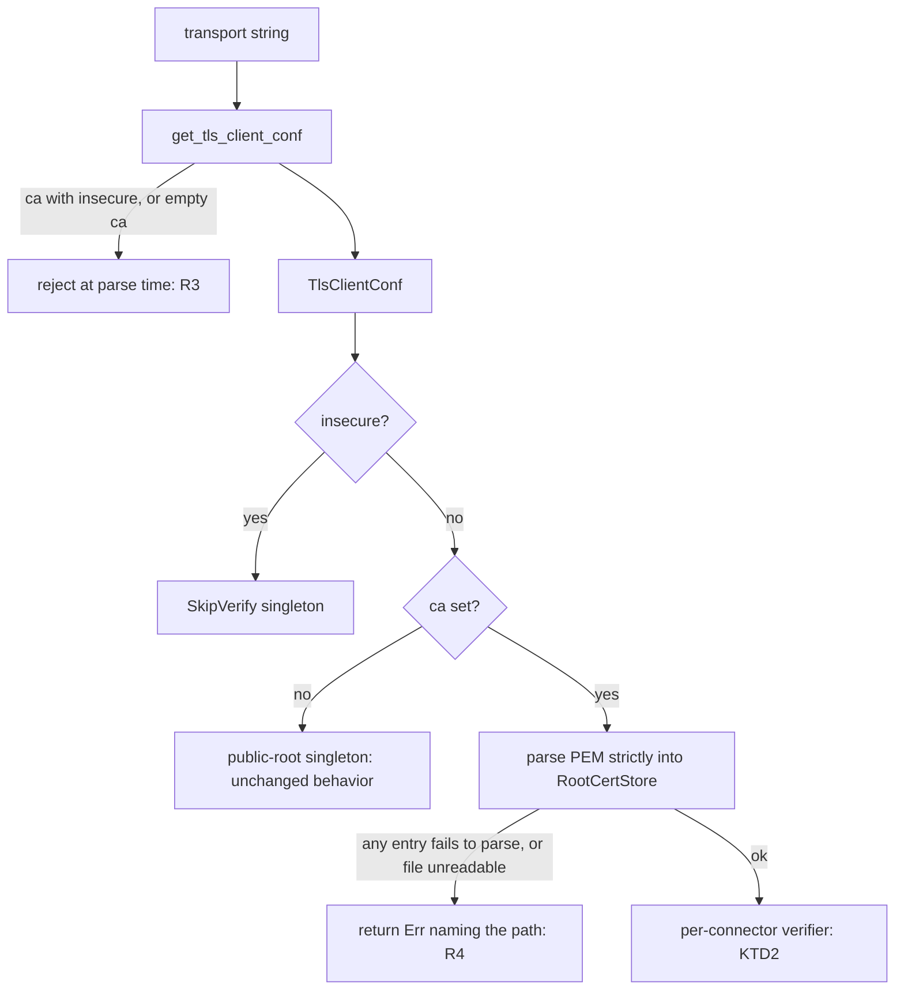
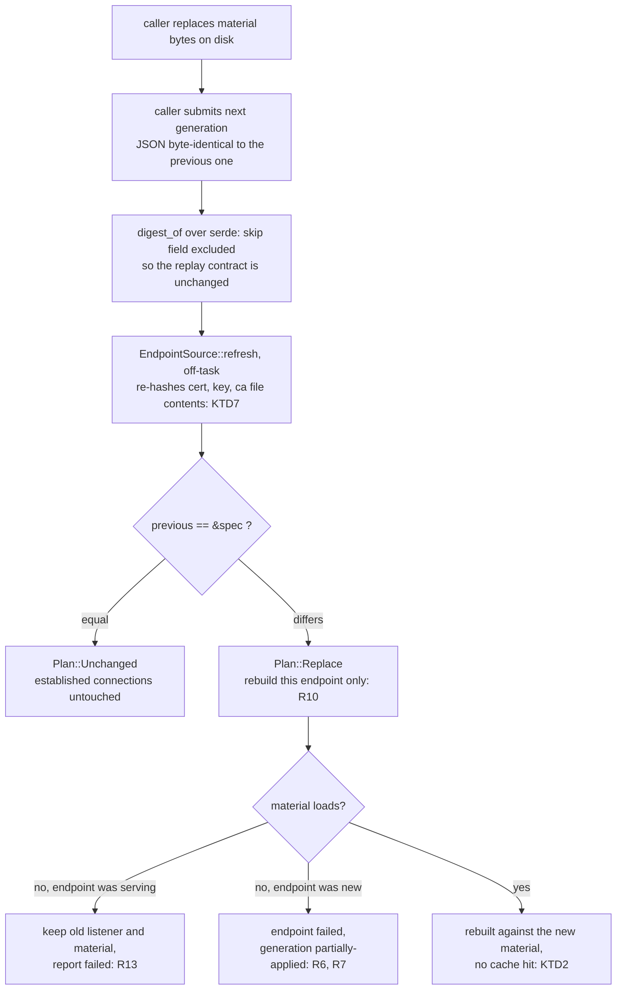
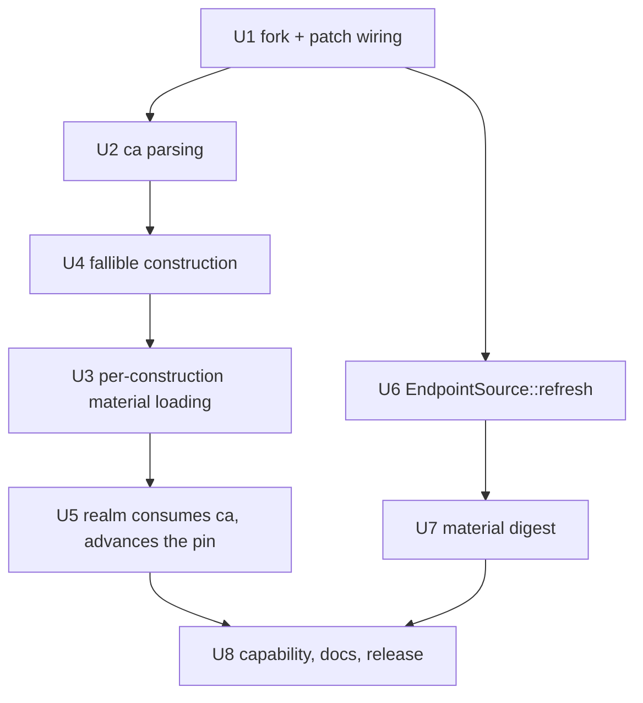

# Realm Internal-CA Peer Verification - Plan

## Goal Capsule

- **Objective:** give realm's client-side TLS and WSS transports a way to verify a peer against a caller-supplied CA root, and make replaced certificate material on disk converge without restarting the process. The work spans two repositories: a `1m1ng/kaminari` fork that adds the option, consumed by `1m1ng/realm` through `[patch.crates-io]`.
- **Product authority:** this document's Product Contract. It defines the option contract; the consuming control plane is planned separately in Tunnel2SS and is not active scope here.
- **Two repositories, one plan.** This document lives in `1m1ng/realm`. Paths are repo-relative to it, except paths prefixed `[kaminari]`, which are relative to the `1m1ng/kaminari` fork's root. Every unit states which repository it lands in.
- **Execution profile:** U3 and U7 are the correctness core — U3 decides what the client trusts and what the server presents, U7 decides when either is reloaded. Both land test-first. U1 is a build-mechanics gate that must go green before any behavior change, so a later failure is attributable to the change rather than to the patch wiring.
- **Stop conditions:** `[patch.crates-io]` fails to resolve inside the `cross` container for `x86_64-unknown-linux-musl` on a cold cache → stop and report; the whole delivery path depends on that target. A git *authentication* failure is not that condition — it means the fork is not publicly readable (U1 step 2) and is fixed by changing the repository's visibility, so do not report it as a `[patch.crates-io]` incompatibility. Any session-settled decision turns out to be unimplementable → stop and report, do not silently reroute.
- **Open blockers:** `cross` is not installed and no unit other than U1 installs it; docker is available. `cargo` and the pinned `nightly-2026-07-22` toolchain are already present under `~/.cargo/bin`, which is not on the default `PATH` — a bare `command -v cargo` reports absence and is misleading.
- **Tail ownership:** commits, review, and the release tag are owned by the execution flow.

---

## Product Contract

**Product Contract preservation:** changed — three corrections and one addition, all traceable to review evidence, none reversing a settled decision.

1. The rationale on the fallible-construction Key Decision was factually wrong. A construction panic is already contained: `build_offloaded` (`realm_core/src/lifecycle/reconcile.rs:817`) runs `EndpointSource::build` under `spawn_blocking` and converts a join error into a failed endpoint, and the release profile sets `panic = "unwind"`. The decision stands; its stated reason did not.
2. The Scope Boundaries entry claimed the server `cert=` / `key=` surface needs no fork change beyond R4. It does: `kaminari`'s `new_crt_key_resolver` caches by private-key path and never re-reads, so R9's server half could not hold. Corrected.
3. R7 was declared on U8, which performs no R7 work; it moved to U5, where the decision actually lands.
4. R13 and AE6 are new. R13 records what the reconciler already does when a rotation's replacement material fails to load on a serving endpoint — behavior R6's wording implied the opposite of. AE6 covers server-side rotation, which R9 always promised and no acceptance example exercised.

The three Deferred-to-Planning questions from the requirements pass were resolved and their section replaced by the open question below.

### Summary

Fork `kaminari` to add a client-side `ca=<path>` option that replaces the compiled-in public trust anchors with roots parsed from that file, remove the process-global certificate caches that would defeat rotation, and make certificate-loading failures returnable rather than fatal. Consume it from `1m1ng/realm`, and fold a digest of each endpoint's certificate material into the endpoint's desired state so that replacing a file on disk is a reconcilable change.

### Problem Frame

Realm delegates all transport-string parsing and TLS construction to `kaminari` (`realm_core/src/tcp/transport.rs`, `kaminari = "0.14"`). On the client side, `kaminari` reads exactly four options — `sni`, `alpn`, `insecure`, `0rtt` — and builds its verifier from `webpki_roots::TLS_SERVER_ROOTS`, a bundle compiled into the binary. It never consults the host trust store, so installing a private CA root on the machine changes nothing. There is no seam for a caller to reach around this: `TlsConnect`'s fields are private and `MixConnect::new` / `new_shared` accept only a `MixClientConf`. Verification against a private CA is therefore unreachable from realm as it stands, and the only way to reach a peer holding a privately issued certificate is `insecure`, which turns verification off entirely.

The second gap is temporal, and it has two independent causes. Realm rebuilds an endpoint only when its desired state differs from the active generation, and that state is derived from the endpoint's configuration document — so replacing the bytes of a certificate file leaves every field identical and the reconcile sees nothing. Even once the rebuild does fire, `kaminari` caches: the server-side resolver is a process-global store keyed on the private-key *path*, so a rebuild with an unchanged path returns the previously built resolver without re-reading either file. Fixing only the first cause produces the worse outcome — connections churn, the control plane reports convergence, and the node keeps serving the pre-rotation certificate.

### Key Decisions

- **Certificate material is part of endpoint state, so realm detects its own rotation.** (session-settled: user-directed — chosen over having the control plane stamp a certificate generation into the configuration document, and over restarting the process on rotation: the control plane stays untouched, and material is semantically part of what an endpoint is.) Governs R9, R10, R13.
- **`ca=` replaces the default trust anchors rather than augmenting them.** Augmenting would let any publicly trusted CA vouch for the internal name, which defeats the point of pinning to a private root. Governs R2.
- **Client authentication is out of scope for this fork pass.** (session-settled: user-directed — chosen over adding mutual TLS in the same change, and over building the option surface now while leaving it unused: the smallest permanent maintenance surface against upstream wins.) Governs the Scope Boundaries entry on mutual TLS.
- **Certificate-loading failures are returned, not panicked.** A contained panic still reports `building the endpoint failed: task N panicked`, which names neither the file nor the reason; the operator cannot act on it. Governs R4.

### Requirements

**kaminari fork — client-side CA verification**

- R1. `get_tls_client_conf` accepts a `ca=<path>` option and `TlsClientConf` carries it. The chosen option name must not prefix-collide with any option the parser already reads, because `get_opt!` matches by `starts_with` rather than by equality.
- R2. When `ca` is present, the client's trust anchors are exactly the roots parsed from that file and `webpki_roots` is not consulted. The file is a PEM document that may hold more than one certificate, and every certificate in it must parse or the whole file is rejected.
- R3. `ca` and `insecure` together are a configuration error, reported at parse time rather than resolved by a silent precedence rule. An empty `ca=` value is the same error, not an absent option.
- R4. Every construction path that reads certificate material or parses a server name returns an error instead of panicking. This covers the new client `ca` path and the existing server `cert` / `key` paths.

**realm — consuming the option**

- R5. `build_transport` carries `ca` from the transport string into the client configuration it hands to `kaminari`, alongside the panic-guard already wrapping the option parsers in `src/conf/endpoint.rs`.
- R6. An endpoint whose transport declares `ca` but whose material is missing or unparseable does not come up, does not fall back to an unverified connection, and does not abort the reconcile for other endpoints in the same generation.
- R7. Such an endpoint reports through the existing per-endpoint failure channel, so the generation lands as `partially-applied` and the caller heals it by submitting a later generation (`docs/control-api.md`).
- R8. Realm advertises the capability token `client-ca-verify` in `GET /v1/capabilities`, so a caller can detect the feature without comparing versions. The literal is a contract with the consuming control plane; a divergence resolves that plane's whole fleet to not-capable with green tests on both sides.

**realm — certificate material as endpoint state**

- R9. An endpoint's desired state includes a digest of the certificate material its transports reference — the client CA file, and the server certificate and key files — so replacing a file's content changes the endpoint's desired state even when every configuration field is byte-identical.
- R10. A material-only change rebuilds only the endpoints that reference the changed material, and the rebuilt endpoint loads the replaced material rather than a cached copy. Endpoints that do not reference it keep their established connections, and the process is not restarted.
- R13. A rotation whose replacement material fails to load on an endpoint that is already serving leaves that endpoint's existing listener and previously loaded material in place, reports it as failed, and heals on the next generation carrying loadable material. This is the reconciler's existing invalid-endpoint behavior, stated so R6's "does not come up" is not read as tearing a serving endpoint down.

**Release and pinning**

- R11. `1m1ng/realm` consumes the fork through a `[patch.crates-io]` entry pinned to an immutable git revision, recorded in `Cargo.lock`. A standing check fails the build if that entry ever resolves to the registry crate instead.
- R12. The release bumps `Cargo.toml`'s version, the git tag, and the string `realm --version` prints, together. The consuming control plane pins all three as one identity, so a divergence makes every node re-download realm on each convergence pass.

### Acceptance Examples

- AE1. A transport string carrying `ca=` pointed at a private root, against a peer presenting a leaf signed by that root whose name matches the requested one, completes the handshake. **Covers R1, R2.**
- AE2. The same transport string against a peer presenting a publicly trusted certificate for the same name fails the handshake. **Covers R2.**
- AE3. A transport string carrying both `ca=` and `insecure`, or one carrying an empty `ca=`, is rejected when the configuration is parsed, before any endpoint binds. **Covers R3.**
- AE4. An endpoint whose `ca=` file is absent fails alone: the process stays alive, sibling endpoints keep serving established connections, and the generation reports `partially-applied` with that endpoint `failed`. **Covers R4, R6, R7.**
- AE5. The CA file's content is replaced while every transport string stays byte-identical; on the next submitted generation the referencing endpoint rebuilds against the new anchor and unrelated endpoints report `unchanged`. **Covers R9, R10.**
- AE6. A server certificate and key are replaced in place, with the transport string's `cert=` and `key=` paths unchanged; on the next submitted generation the rebuilt acceptor presents the new leaf rather than the pre-rotation one. **Covers R9, R10.**

### Scope Boundaries

- Mutual TLS. The server side keeps accepting any client, and the client sends no certificate. Reopening this means touching four points in the fork instead of two; it is a separate decision.
- Revocation. Neither CRL nor OCSP is in reach on this path, so withdrawing trust from a holder means replacing the root and reissuing. The stapled-response file a server transport can name through `ocsp=` is outside the rotation digest for the same reason.
- Upstream contribution. The `ca=` option is not proposed to `zephyrchien/kaminari` as part of this work.
- The server-side `cert=` / `key=` option *surface* is unchanged — `kaminari` already parses both. Its *caching* is not: the path-keyed resolver store has to go for R9's server half to hold, and that is a fork change beyond R4.
- Filesystem watching. Realm does not poll or watch certificate files; the caller's desired-state submission remains the only reconcile trigger.

### Dependencies / Assumptions

- The baseline is `kaminari` 0.14.0 as pinned in `Cargo.lock`. Verified against that source: the client parser reads `sni` / `alpn` / `insecure` / `0rtt` and nothing else; the non-insecure verifier is built from `webpki_roots::TLS_SERVER_ROOTS`; the server parser reads `cert` / `key` / `servername`, and falls back to generating a self-signed certificate at runtime through `rcgen` when only `servername` is given.
- Unknown options in a transport string are silently ignored today, so an older binary receiving a string that carries `ca=` neither errors nor verifies — it falls through to the public-root verifier. The consuming plan owns the rollout consequence; R8's capability token is what lets it gate.
- The name a client verifies is the value of `sni=`. The literal the consuming plan uses is `realm.tunnel2ss.internal`; the fork itself is agnostic to it.
- Two literals are shared with the consuming plan and must match exactly: that name, and the capability token `client-ca-verify` of R8. Both are asserted by test on the consuming side; R8's is asserted here.
- Realm's control API already carries per-endpoint apply outcomes and a `partially-applied` generation state, so R7 reuses an existing channel rather than adding one.
- `cross` mounts the host `$CARGO_HOME`, including `~/.cargo/git`. A `cross` build run after a host-side `cargo` invocation therefore reuses an already-fetched git checkout and proves nothing about resolution inside the container — U1's gate has to run cold.
- **Rotation depends on the caller submitting a new generation.** Realm refreshes derived state on submission, not on a timer. U6 makes a same-generation resubmission whose material changed refuse rather than replay, so a stale-material convergence is reported instead of silently confirmed; a caller that never resubmits at all is still outside realm's reach.
- `EndpointConf`'s equality stops being a pure function of the value once the material digest lands: the same value compared against itself across a rotation differs. No current consumer keys a map or memoizes on it; any future one would be silently wrong.

### Open Questions

**Deferred to implementation** (non-blocking; U4 as written is implementable either way)

- Whether the fallible-construction change (R4 / KTD4) earns its permanent divergence, or whether extending realm's existing `guard` in `src/conf/endpoint.rs` to wrap the two `new_shared` calls would deliver enough of it. The guard already converts a panic into a field-named `BuildError`, so the alternative costs about four lines of realm code and no upstream API change; what it loses is the failing file's path, leaving the operator the transport string and a static reason. This plan keeps KTD4 — see its rationale for why the P0 resolver-cache fix changed the calculus — but the question is worth revisiting if the rebase cost ever bites.

### Sources / Research

- `realm_core/src/tcp/transport.rs` — realm's delegation to `kaminari::mix`.
- `src/conf/endpoint.rs` — `build_transport`, and the existing guard that converts `kaminari`'s parse panics into a `BuildError`. `EndpointConf` derives `PartialEq, Eq, Serialize, Deserialize`; `EndpointSource` is implemented at the file's tail.
- `realm_core/src/lifecycle/reconcile.rs` — the `EndpointSource` trait, the `previous == &spec` diff, `digest_of`'s serde-based submission hash, `build_offloaded`'s panic containment and its stated reason for existing, the invalid-endpoint arm that keeps a serving listener alive, and the snapshot restore path that populates `applied`.
- `realm_core/src/lib.rs` — the `kaminari` re-export is gated on the `transport` feature, which `default-slim` does not enable.
- `docs/control-api.md` — generation semantics, per-endpoint `failed` / `retryable` reporting, `partially-applied`, and the `capabilities` probe that the doc prescribes over version comparison.
- `kaminari` 0.14.0 `src/opt.rs`, `src/tls.rs`, `src/mix.rs` — the option parsers, the `get_opt!` prefix-matching macro and its empty-value rule, `firefox_roots()`, the `lazy_static` client verifier singletons, the path-keyed `new_crt_key_resolver` store, the `rcgen` self-signed fallback, and the `MixConnect` / `MixAccept` constructors.
- `kaminari` 0.14.0 `Cargo.toml` — `rustls-pemfile` is already a `tls`-feature dependency, and `tls-ring` / `tls-awslc` select only the crypto provider.
- `.github/actions/build/cross/action.yml` — the release path cross-builds `--no-default-features --features default-slim` for every published target.

<!-- ce-section: work-relationships -->
### How This Work Fits Together

This plan owns one half of a two-repository change: the option contract and the reconcile behavior that live in `1m1ng/kaminari` and `1m1ng/realm`. The other half — who runs the certificate authority, what it issues, and how the material and the transport strings reach a node — is planned in Tunnel2SS as `docs/plans/2026-07-31-004-fix-realm-peer-trust-plan.md`. The breakdown below is the current understanding, not a committed roadmap.

- Realm-side option and reconcile contract (this plan)
  - Enables the Tunnel2SS delivery design, which cannot name what it writes to disk until the option name, the accepted PEM shape, and the missing-file behavior are fixed here.
  - Shares one literal with it: the name the client verifies.
  - Can proceed independently of the certificate authority's design; nothing here depends on how the root is generated or stored.
- Tunnel2SS certificate authority, delivery, and transport-string flip
  - Depends on a `1m1ng/realm` release carrying this work.
  - Still to decide: where the capability signal of R8 is read, which the consuming plan owns.
  - Still to decide: whether material is delivered by write-then-rename. R9's digest and R13's failure path are both safe against a torn read only if it is.

---

## Planning Contract

### Key Technical Decisions

- KTD1. **The option name is `ca`, and its value is a filesystem path.** `get_opt!` matches by `starts_with`, so a new name must not prefix any key a parser already reads, and must not be prefixed by one. `ca` collides with none of `sni`, `alpn`, `insecure`, `0rtt`, `cert`, `key`, `servername`, `ocsp`, `ws`, `host`, `path`. Governs R1.
- KTD2. **Certificate material is loaded per construction, never from a process-global cache — on both sides.** `utils::new_verifier` returns `lazy_static` singletons for the public-root and skip-verify cases, which is safe because both are process-global; a CA verifier is not, because one process can hold connectors pinned to different roots. The server side has the same hazard in a less visible form: `new_crt_key_resolver` keys its store on the private-key path and never evicts, so a rebuild after rotation returns the pre-rotation resolver and the node keeps serving the old leaf while the control plane reports convergence. Both caches go. Governs R2, R10.
- KTD3. **The material digest lives on `EndpointConf` as a `#[serde(skip)]` field, refreshed through a new `EndpointSource::refresh` hook.** (session-settled: user-directed — chosen over having the control plane stamp a certificate generation into the configuration document, and over restarting the process on rotation: the control plane stays untouched, and material is semantically part of what an endpoint is.) The reconciler's diff compares `S` by derived `PartialEq`, while `digest_of` compares it through serde. A `#[serde(skip)]` field therefore enters the diff and stays out of the submission hash, so rotation forces a rebuild without breaking the same-generation replay contract. Governs R9, R10, R13.
- KTD4. **Fallible construction changes kaminari's public constructor signatures to `Result`.** The alternative — a fallible variant beside each infallible one — doubles the surface and leaves the panicking path reachable. Governs R4.
- KTD5. **The fork freezes at kaminari 0.14.0 as two ordered, separately rebasable commits.** The first is additive: the `ca` option and its verifier. The second is a public-API break: `Result` signatures across four constructors plus `mix.rs` propagation (KTD4), and the removal of the path-keyed resolver store (KTD2). A future bump must re-apply the second together with realm's call sites, so it is not the cheap option-addition rebase this decision would otherwise imply — the resolver-cache removal alone already forecloses a purely additive fork, which is also why KTD4's marginal cost is small. Bump when upstream ships something realm needs, or when a rustls major stops resolving against 0.14.0; nothing else triggers it. Governs R11.
- KTD6. **Digest inputs are the file contents named by `cert` and `key` in `listen_transport` and by `ca` in `remote_transport`, parsed with kaminari's own `get_opt!`.** Reusing the parser keeps the digest's view of the transport string identical to the constructor's view; a second hand-rolled parser would drift. Governs R9.
- KTD7. **`refresh` runs off the reconciler task, in the same `spawn_blocking` boundary `build_offloaded` uses.** The reconciler is a single serial consumer that also answers status and readiness; `build` was moved off it for latency, not payload size, and certificate reads have the same shape — a path on a hung mount would wedge the whole control plane with no timeout and no `catch_unwind` recovery. Governs R9.

### High-Level Technical Design

Client trust-anchor selection inside the fork. The parse phase owns the conflict and empty-value rejections; only the `ca` branch reads the filesystem, and only it can fail at construction:

Rotation detection, end to end. The refresh hook is what makes a byte-identical submission diff as changed; removing both caches is what makes the rebuild actually load the new bytes:

### Assumptions

- The `EndpointSource::refresh` default no-op keeps every existing implementor source-compatible, so adding the hook is not a breaking change for `realm_core`'s public API beyond the trait gaining a defaulted method.
- Hashing whole certificate files on every submission is acceptable once the read is off-task per KTD7. Submissions are operator-paced rather than per-connection.
- A `cross` container can resolve a `[patch.crates-io]` git dependency over unauthenticated `https://` given network access at build time. U1 exists to prove this on a cold cache before anything depends on it.
- A TOCTOU window exists between `refresh` hashing a file and construction re-reading it. It costs at most one spurious rebuild and self-heals on the next generation, so it is not designed against.

### Sequencing

U1 gates everything. The kaminari chain and the reconcile chain are independent after U1 and can run in parallel; U8 needs both. Inside the kaminari chain the `Result` signatures (U4) land *before* the CA verifier (U3), so the only branch that can fail is written against an already-fallible constructor instead of shipping an interim `.expect`.

U6 and U7 depend on U1 only for the toolchain; they compile against baseline kaminari and need neither the fork nor the patch entry. The Goal Capsule's cross stop condition therefore halts the kaminari chain and the release, not the reconcile chain. U7's full-feature gate is only meaningful once U5's pin advance has landed in the shared lockfile.

---

## Implementation Units

### U1. Fork kaminari and wire the patch, with no behavior change

- **Repository:** both.
- **Goal:** `1m1ng/kaminari` exists at kaminari 0.14.0's source, realm builds against it through `[patch.crates-io]`, and the musl cross target builds from a cold cache.
- **Requirements:** R11
- **Dependencies:** none
- **Files:** `Cargo.toml`, `Cargo.lock`, `[kaminari] Cargo.toml`
- **Approach:**
  1. Put `~/.cargo/bin` on `PATH` — `cargo` and `nightly-2026-07-22` are already installed there — and install `cross`, which is absent. Docker is available.
  2. Create `1m1ng/kaminari` from `zephyrchien/kaminari` at the 0.14.0 tag, **publicly readable**. Keep the crate name and version so the patch resolves. A private fork gives the `cross` container no credentials and fails in a way that mimics the stop condition.
  3. Add a `[patch.crates-io]` entry for `kaminari` to the workspace root `Cargo.toml`, pinned to an immutable revision. Commit the resulting `Cargo.lock`.
  4. Build for `x86_64-unknown-linux-musl` through `cross` — that is the archive the consuming control plane pins.
- **Execution note:** land this before any kaminari behavior change, so a later build failure is attributable to the change rather than to the patch wiring.
- **Test scenarios:**
  - `cargo test --no-fail-fast` passes unchanged against the patched dependency.
  - `Cargo.lock` records kaminari's source as a git revision, not the registry.
  - A `cross` build for `x86_64-unknown-linux-musl` completes **with an empty `CARGO_HOME` git database**, proving the git patch resolves inside the container. `cross` mounts the host `$CARGO_HOME`, so a build following a host-side `cargo` invocation reuses an already-fetched checkout and does not satisfy this gate.
- **Verification:** the default-feature suite is green and the cold-cache musl cross build produces a binary.

### U2. `ca` option parsing in kaminari

- **Repository:** `1m1ng/kaminari`.
- **Goal:** `get_tls_client_conf` reads `ca=<path>` into a new `TlsClientConf` field, and the two conflicting shapes are rejected.
- **Requirements:** R1, R3
- **Dependencies:** U1
- **Files:** `[kaminari] src/opt.rs`, `[kaminari] src/tls.rs`
- **Approach:**
  1. Add a `ca` field to `TlsClientConf` and include it in the `Display` impl beside the existing options.
  2. Read it with the existing `get_opt!` macro. The name is safe against prefix collision per KTD1.
  3. Reject `ca` together with `insecure` at parse time, using the same failure shape the parser already uses for `tls: require sni`, so realm's existing `guard` in `src/conf/endpoint.rs` converts it into a `BuildError`.
  4. Reject an empty `ca=` the same way. `get_opt!`'s empty-value rule maps it to absence, which would silently return the connector to public-root verification — the exact downgrade this plan exists to remove, arrived at through a control plane rendering an unset template variable.
- **Patterns to follow:** the table-driven `#[cfg(test)]` module at the tail of `[kaminari] src/opt.rs`, which already asserts client and server parses row by row.
- **Test scenarios:**
  - `tls;sni=a.b.c;ca=/x/root.pem` parses with the CA path captured and `insecure` false.
  - `tls;sni=a.b.c` parses with no CA — every existing row still passes.
  - `tls;sni=a.b.c;ca=` is rejected, not treated as absent. Covers AE3.
  - `tls;sni=a.b.c;ca=/x;insecure` is rejected. Covers AE3.
  - `tls;key=/a;cert=/b` still parses as a server conf and reads `cert`, confirming no prefix collision.
- **Verification:** kaminari's suite passes under both `tls-awslc` and `tls-ring`.

### U3. Per-construction material loading, client and server

- **Repository:** `1m1ng/kaminari`.
- **Goal:** when `ca` is set the client's trust anchors are exactly the roots parsed from that file, and neither side serves material from a process-global cache.
- **Requirements:** R2, R10
- **Dependencies:** U4
- **Files:** `[kaminari] src/tls.rs`
- **Approach:**
  1. In the `utils::client` module, add a constructor that parses a PEM file into a `RootCertStore` and builds a verifier from it. `rustls-pemfile` is already a `tls`-feature dependency, so this adds none.
  2. Parse strictly: every certificate in the file must parse, and the first failure is the construction error. The permissive path silently drops invalid entries, which during a dual-root rotation window leaves the node with one anchor and no signal. Do not reuse `read_certificates` for the CA file — its raw-DER fallback turns a non-PEM file into one bogus anchor.
  3. Extend `new_verifier` with the CA case. The public-root and skip-verify singletons stay as they are; the CA verifier is per connector, per KTD2.
  4. Remove the path-keyed store in `utils::new_crt_key_resolver` so `TlsAccept::new_shared` builds its resolver from freshly read `cert` and `key` bytes on every construction. Without this the server half of R9 cannot hold — the rebuild is a cache hit and the old leaf keeps being served.
  5. Honor `ca` in both `TlsConnect::new` and `TlsConnect::new_shared`. Realm exercises `new_shared`, but leaving `new` inconsistent is a trap for any later caller.
- **Execution note:** implement test-first. This unit decides what the client trusts and what the server presents; a green test that never exercised a rejection or a rotation would be worse than no test.
- **Test scenarios:**
  - A connector built with `ca` pointed at a private root accepts a peer whose leaf that root signed and whose name matches the requested one. Covers AE1.
  - The same connector rejects a peer presenting a publicly trusted certificate for that name. Covers AE2.
  - A connector built with `ca` pointed at a root that did not sign the peer's leaf rejects the handshake.
  - A CA file holding two valid roots accepts a leaf signed by either.
  - A CA file holding one valid root plus one corrupt entry returns an error naming the path, rather than building with the surviving root.
  - Two successive acceptor constructions with the same `cert` / `key` paths but replaced file contents present different leaves — the second must not be a cached copy of the first. Covers AE6.
  - With neither `ca` nor `insecure` set, verification still goes through the public-root path — existing behavior does not move.
- **Verification:** kaminari's suite is green under both crypto providers.

### U4. Fallible certificate construction

- **Repository:** `1m1ng/kaminari`.
- **Goal:** the TLS constructors return errors instead of panicking, so a caller can report which file failed and why.
- **Requirements:** R4
- **Dependencies:** U2
- **Files:** `[kaminari] src/tls.rs`, `[kaminari] src/mix.rs`
- **Approach:**
  1. `TlsConnect::new` / `new_shared` and `TlsAccept::new` / `new_shared` return `Result`, per KTD4. Cover the unreadable or unparseable `cert` and `key` cases, and a `sni` value the server-name parser rejects. The `ca` cases arrive with U3, against these already-fallible signatures.
  2. `MixConnect` and `MixAccept` constructors propagate. Realm calls the `_shared` variants, so those are load-bearing; the direct variants move for consistency.
  3. Leave the `servername`-only server path's self-signed generation behavior alone. It reads no files.
- **Execution note:** this lands before U3 so the CA branch — the only path the design marks as failure-prone — is never written against an infallible signature and never ships an interim `.expect`. The gain from R4 is the error message, not process survival: a construction panic is already contained by `build_offloaded`'s `spawn_blocking` join and `panic = "unwind"`. Assert on the error's content, not on the process staying alive.
- **Test scenarios:**
  - Building a server acceptor whose `cert` path does not exist returns an error naming that path.
  - Building a server acceptor whose `key` file holds no private key returns an error.
  - A `sni` value that is not a valid DNS name returns an error rather than panicking.
  - The `servername`-only server path still produces a self-signed certificate and succeeds.
- **Verification:** kaminari's suite is green; realm compiles once U5 adapts the call sites.

### U5. realm consumes `ca`, and advances the patch pin

- **Repository:** `1m1ng/realm`.
- **Goal:** realm builds against the finished fork, `build_transport` passes `ca` through, and a construction failure becomes a `BuildError` naming the offending field.
- **Requirements:** R5, R6, R7, R11
- **Dependencies:** U3
- **Files:** `Cargo.toml`, `Cargo.lock`, `src/conf/endpoint.rs`, `tests/conf.rs`, `tests/control.rs`
- **Approach:**
  1. Advance the `[patch.crates-io]` revision from U1's untouched baseline to the commit carrying U2–U4, and commit the regenerated `Cargo.lock`. Nothing else moves this pin, and until it moves realm still compiles against a kaminari with no `ca` field and infallible constructors.
  2. `build_transport` already parses both transport strings under `guard`. Map the now-fallible `MixAccept::new_shared` and `MixConnect::new_shared` results onto `BuildError` for `listen_transport` and `remote_transport` respectively.
  3. `EndpointSource::build` surfaces that as the endpoint's error, which the control API already reports per endpoint. No new reporting channel — R7.
  4. Never fall back to an unverified connection when CA material fails to load — R6.
- **Patterns to follow:** the existing `BuildError::new(field, value, reason)` construction in `src/conf/endpoint.rs`, and the `listen_transport` / `remote_transport` failure assertions already in `tests/conf.rs`.
- **Test scenarios:**
  - An `EndpointConf` whose `remote_transport` names a nonexistent CA path fails to build, and the error names `remote_transport` and the path.
  - An `EndpointConf` whose `remote_transport` carries both `ca` and `insecure` fails to build. Covers AE3.
  - An `EndpointConf` with a valid CA path builds.
  - An `EndpointConf` with no transport strings still builds — the transport path stays optional.
  - Through the control API: submit a generation whose CA path does not exist — that endpoint reports failed with an error naming the path, siblings report their own outcomes, and the generation state is partially applied. Covers AE4.
- **Verification:** `cargo test --no-fail-fast` is green against the advanced pin.

### U6. `EndpointSource::refresh` hook

- **Repository:** `1m1ng/realm`.
- **Goal:** the reconciler refreshes each desired endpoint's caller-owned derived state before diffing, off the serial task, and on snapshot restore.
- **Requirements:** R9
- **Dependencies:** U1
- **Files:** `realm_core/src/lifecycle/reconcile.rs`, `realm_core/tests/reconcile.rs`, `realm_core/tests/snapshot.rs`
- **Approach:**
  1. Add a defaulted no-op `refresh` method to `EndpointSource`, so existing implementors are unaffected.
  2. Call it on every incoming spec in `Reconciler::apply_generation`, before the diff loop, inside the same `spawn_blocking` boundary `build_offloaded` uses — per KTD7. Running it inline would put unbounded blocking reads back on the task that also answers status and readiness.
  3. Call it on each restored spec in `Reconciler::restore` before the spec enters `applied`, so restored state reflects what is on disk now rather than what was on disk when the snapshot was written. Without this, the first submission after a restart always diffs as changed.
  4. On the `generation == active` replay path, compare each refreshed incoming spec against its `applied` counterpart and return the existing stale-generation conflict instead of replaying when the material digest differs. A cached "converged" answer for material the endpoint is no longer running is a false success that persists until something unrelated forces the next generation.
  5. Leave `digest_of` alone. It serializes through serde, so a `#[serde(skip)]` field is invisible to it and the replay contract for genuine retries is unchanged — KTD3.
- **Execution note:** the restore call site is the easy one to miss, and missing it costs a spurious rebuild of every TLS endpoint on each restart. Cover it explicitly.
- **Patterns to follow:** `realm_core/tests/reconcile.rs` and `realm_core/tests/snapshot.rs` already define test `EndpointSource` implementations; extend those rather than adding a third shape.
- **Test scenarios:**
  - A test source whose `refresh` increments a counter is refreshed once per submitted endpoint per generation.
  - Two submissions that are serde-identical but whose refreshed state differs diff as a replace, not as unchanged.
  - Those same two submissions carrying the same generation number, with the derived state unchanged between them, still replay — proving the submission hash does not see the derived field.
  - The same generation resubmitted after the derived state changed is refused as a conflict rather than replayed.
  - A restored snapshot entry is refreshed before it enters the applied map, and a submission matching on-disk state right after a restore diffs as unchanged.
- **Verification:** `cargo test -p realm_core --no-fail-fast --features proxy,balance,multi-thread,batched-udp` is green.

### U7. Certificate material digest on `EndpointConf`

- **Repository:** `1m1ng/realm`.
- **Goal:** replacing the bytes of a referenced certificate file changes the endpoint's desired state, so that endpoint rebuilds and no other does.
- **Requirements:** R9, R10, R13
- **Dependencies:** U6
- **Files:** `src/conf/endpoint.rs`, `tests/conf.rs`, `tests/control.rs`
- **Approach:**
  1. Add a `#[serde(skip)]` digest field to `EndpointConf`. The struct derives `PartialEq`, so the field enters the reconciler's comparison while staying out of serde — KTD3.
  2. Implement `refresh` to recompute it from the file contents named by `cert` and `key` in `listen_transport` and by `ca` in `remote_transport`, parsed with kaminari's `get_opt!` — KTD6.
  3. The field is present in every feature configuration; only `refresh`'s body is `#[cfg(feature = "transport")]`-gated, yielding a stable no-op digest in the slim build. `realm_core`'s `kaminari` re-export does not exist without `transport`, and the release path cross-builds `--features default-slim` for every target, so an ungated body reddens the release rather than the unit.
  4. Hash each path together with its content, and give an unreadable path a distinct marker, so material appearing or disappearing is also a change. Cap each read at a fixed byte limit and treat an over-limit path as the unreadable case.
  5. Rebuild scope needs no new code: the existing reconciler already replaces only endpoints whose desired state differs and never restarts the process — R10.
- **Execution note:** implement test-first, starting with the equality tests. This unit decides when a running endpoint gets torn down; an over-eager digest churns live connections and an under-eager one silently serves an expired certificate.
- **Test scenarios:**
  - Two `EndpointConf` values identical except for the content of the file their CA option points at compare unequal after refresh.
  - Two `EndpointConf` values identical except for the content of the file their `cert` option points at compare unequal after refresh; the same holds for `key`.
  - Two identical values pointing at unchanged files compare equal after refresh.
  - A value whose CA file is deleted between refreshes compares unequal to its earlier self.
  - A value with no transport strings has a stable digest across refreshes and never forces a rebuild.
  - Serializing produces JSON with no digest field, and deserializing JSON that lacks one succeeds.
  - Through the control API: submit a generation, replace the CA file's content, then submit the next generation with byte-identical JSON — the referencing endpoint reports updated and the others report unchanged. Covers AE5.
  - Through the control API: the same, replacing a server `cert` and `key` — the rebuilt acceptor presents the new leaf. Covers AE6.
  - Through the control API: apply a generation successfully, corrupt the CA file, submit the next generation — the endpoint reports failed while its established listener keeps serving, and the applied digest stays at the old value. Covers R13.
- **Verification:** `cargo test --no-fail-fast` and the slim build are both green, with the rotation and failure paths covered end to end in `tests/control.rs`.

### U8. Capability token, documentation, and release

- **Repository:** `1m1ng/realm`.
- **Goal:** a caller can detect client-side CA verification without comparing versions, and the release is pinned for the consuming control plane.
- **Requirements:** R8, R12
- **Dependencies:** U5, U7
- **Files:** `src/control/api.rs`, `docs/control-api.md`, `readme.md`, `Cargo.toml`
- **Approach:**
  1. Add a capability token to the capabilities list in `src/control/api.rs`, served by both `GET /v1/version` and `GET /v1/capabilities`.
  2. Document the token and the `ca=` transport option in `docs/control-api.md`, beside the existing guidance to probe capabilities rather than compare versions.
  3. Document `ca=` in `readme.md` alongside the other transport options.
  4. Bump `Cargo.toml`'s version. The execution tail cuts the tag, which must match the manifest version and the string `realm --version` prints — R12.
- **Test scenarios:**
  - `GET /v1/capabilities` includes the new token, and `GET /v1/version` returns the same document.
  - The version the binary prints matches the manifest.
- **Verification:** `cargo test --no-fail-fast` is green and the release workflow publishes `realm-x86_64-unknown-linux-musl.tar.gz`.

---

## Verification Contract

Run in the repository each command belongs to. The realm test commands mirror `.github/workflows/ci.yml`; `cargo fmt --check` is an added gate, not a mirrored one.

| Gate | Command | Applies to |
|---|---|---|
| Formatting | `cargo fmt --check` | U1–U8 |
| Lint | `cargo clippy` | U1–U8 |
| Patch integrity | `Cargo.lock`'s `kaminari` entry carries a `git+` source at the expected revision | U1–U8 |
| Core, feature matrix | `cargo test -p realm_core --no-fail-fast --features proxy,balance,multi-thread,batched-udp` | U6 |
| Full, default features | `cargo test --no-fail-fast` | U1, U5, U7, U8 |
| Slim build | `cargo test --no-fail-fast --no-default-features --features default-slim` | U1, U5, U6, U7 |
| Fork, aws-lc provider | `cargo test --features all,tls-awslc` in `1m1ng/kaminari` | U2, U3, U4 |
| Fork, ring provider | `cargo test --features all,tls-ring` in `1m1ng/kaminari` | U2, U3, U4 |
| Delivery target | `cross build --release --target x86_64-unknown-linux-musl`, cold `CARGO_HOME` | U1, U8 |

Three gates are non-negotiable regardless of green tests.

Every test asserting a rejection — AE2, AE3, AE4, the CA-mismatch and corrupt-entry cases in U3, and the stale-material replay refusal in U6 — must be observed failing against the pre-change tree, because a verification test that never rejected anything proves nothing.

The musl cross build must pass in U1 with a cold `CARGO_HOME`, before any behavior change. A warm host cache makes the gate vacuous.

Patch integrity is a standing gate, not a one-shot U1 check, and it belongs in `.github/workflows/ci.yml`. A `[patch.crates-io]` entry that stops applying is a cargo warning, not an error: the tree silently falls back to the registry crate, `ca=` becomes an ignored option again, and every client reverts to public-root verification with no failure pointing at the cause.

---

## Definition of Done

Global:

- Every requirement R1–R13 is satisfied, and every acceptance example AE1–AE6 has a test that enforces it.
- Every gate in the Verification Contract is green in both repositories.
- Each rejection test was observed failing before its unit's change landed.
- The `1m1ng/kaminari` fork carries only the changes this plan describes, as the two ordered commits KTD5 names.
- `Cargo.lock` pins kaminari to the immutable revision carrying U2–U4, and the standing patch-integrity gate is wired into CI.
- The release tag, `Cargo.toml`'s version, and `realm --version` agree.
- `docs/control-api.md` and `readme.md` document the capability token and the `ca=` option.
- No abandoned experimental code remains: scratch verifiers, commented-out constructor variants, and any temporary test fixtures generated while exploring rustls' API are removed from the diff.

Per unit:

- U1 — realm builds and tests green against the patched dependency, and a cold-cache musl cross build produces a binary.
- U2 — the client parser reads the CA option, and rejects it both alongside `insecure` and with an empty value.
- U3 — a connector pinned to a private root accepts a leaf that root signed and rejects a publicly trusted certificate for the same name; a second acceptor construction after replaced `cert` / `key` bytes presents the new leaf.
- U4 — every certificate-reading construction path returns an error naming the file rather than panicking.
- U5 — the pin points at the finished fork, and a failed CA load fails one endpoint with a field-named error without downgrading to an unverified connection.
- U6 — the refresh hook runs off-task on submission and on restore, the submission hash still ignores the derived field, and a same-generation resubmission after a material change is refused rather than replayed.
- U7 — replacing a certificate file's bytes rebuilds only the referencing endpoint with byte-identical configuration JSON, the slim build compiles, and a failed rotation leaves the serving listener untouched.
- U8 — the capability token is served on both endpoints, and the release is published for the musl target.
